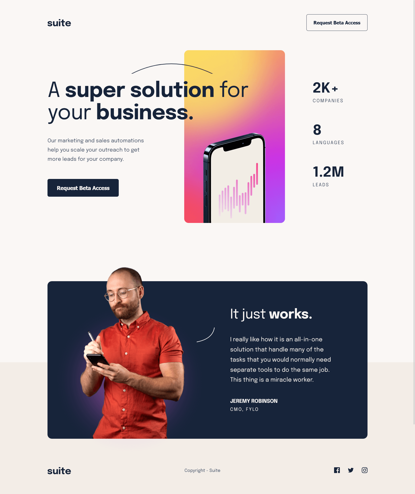
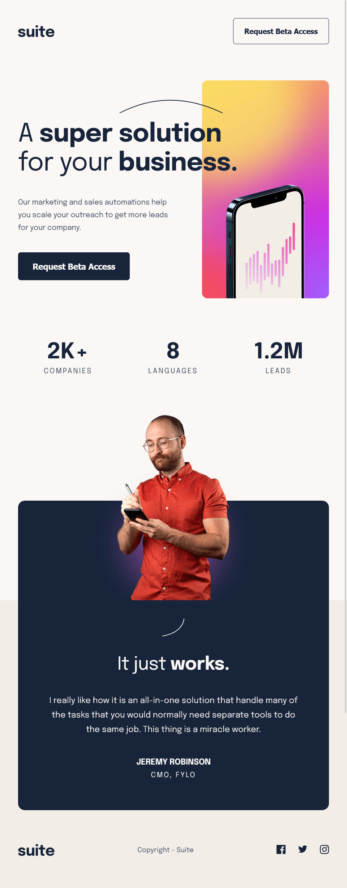
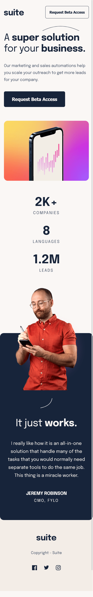

# Frontend Mentor - Suite landing page solution

This is a solution to the [Suite landing page challenge on Frontend Mentor](https://www.frontendmentor.io/challenges/suite-landing-page-tj_eaU-Ra). Frontend Mentor challenges help you improve your coding skills by building realistic projects.

## Table of contents

- [Overview](#overview)
  - [The challenge](#the-challenge)
  - [Screenshot](#screenshot)
  - [Links](#links)
- [My process](#my-process)
  - [Built with](#built-with)
  - [What I learned](#what-i-learned)
  - [Useful resources](#useful-resources)
- [Author](#author)

## Overview

### The challenge

Users should be able to:

- View the optimal layout depending on their device's screen size
- See hover states for interactive elements

### Screenshot

Desktop

---

Tablet

---

Mobile

### Links

- Solution URL: [https://github.com/mihalymarcell86/suite-landing-page](https://github.com/mihalymarcell86/suite-landing-page)
- Live Site URL: [https://mihalymarcell86.github.io/suite-landing-page/](https://mihalymarcell86.github.io/suite-landing-page/)

## My process

### Built with

- Semantic HTML5 markup
- Sass

### What I learned

With this project, the clear distinction between art-direction and resolution switching finally clicked, and I understood how to combine them, also including modern MIME types.

### Useful resources

- [MDN - Responsive Images](https://developer.mozilla.org/en-US/docs/Learn/HTML/Multimedia_and_embedding/Responsive_images) - Proved to be useful time and time again. Everything one needs to know about responsive images.

## Author

- GitHub - [@mihalymarcell86](https://github.com/mihalymarcell86)
- Frontend Mentor - [@mihalymarcell86](https://www.frontendmentor.io/profile/mihalymarcell86)
